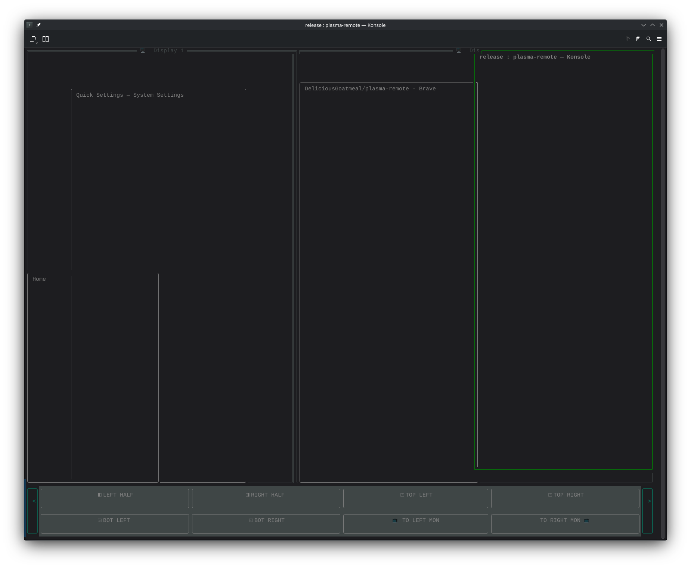

# Plasma Remote

**Plasma Remote** is a lightweight terminal-based UI for managing windows on KDE Plasma.
It uses `kdotool`, `dbus-send`, and `pactl` to query and control windows, move/resize them (tiling), and swap audio sinks.

## 📷 Screenshot



## 🧩 Features

- Visual overview of open windows and monitors in a terminal UI
- Click-to-activate windows
- Drag windows around using mouse drag
- Double-click a window to maximize it (via KDE shortcut)
- Built-in tiling commands:
  - Left/Right half, quadrants (top-left, top-right, bottom-left, bottom-right)
  - Auto tile (grid layout) and “chaos” tile (random distribution)
- KDE shortcut integration for:
  - Maximize, fullscreen, minimize, close
  - Move window between monitors
- Smart audio sink swap between HDMI and USB/Focusrite devices

## ✅ Requirements

- Linux with **KDE Plasma**
- `kdotool` (for window manipulation)
- `dbus-send` (usually included in `dbus-user-session` or `dbus` packages)
- `pactl` (from PulseAudio)
- Rust toolchain (for building)

## 🚀 Build & Run

```sh
# Build
cargo build --release

# Run
cargo run --release
```

> The program runs in an alternate screen buffer. Press `q` to quit.

## 🎮 Controls

- **Mouse click** on a window to activate it.
- **Drag** a window to move it.
- **Double-click** a window to maximize it (KDE shortcut invoked).
- **Toolbar buttons** (at bottom):
  - `<` / `>` to switch between action pages
  - Page 1: tiling commands, monitor moves
  - Page 2: maximize, fullscreen, minimize, close, auto-tile, chaos-tile, audio swap

## 🛠 Notes

- The application detects monitors by finding top-level windows that look like Plasma desktops and then adjusts for panels.
- Tiling uses a fixed gap of `16px` and splits the screen into halves/quadrants.
- Audio sink swapping looks for sink names containing `hdmi`, `Focusrite`, or `usb`.

## ✨ Contributing

Feel free to open issues or submit PRs to improve the tiling logic, support additional desktop environments, or add new actions.

---

*Made with Rust and a lot of terminal UI love.*
